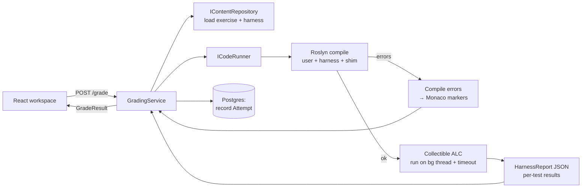

# DotNetDojo 🥋

An interactive **.NET interview-prep platform**. Learners read a lesson, then solve C#
coding exercises in an in-browser editor; the backend **compiles and runs their code
against hidden tests** and returns per-test feedback with inline error markers.

Built as a portfolio-grade, full-stack app: **.NET 9 (clean architecture) + PostgreSQL +
React/TypeScript**, with a **Roslyn-based code-execution engine** at its core.

---

## Features

- **Live C# grading** — submit code, get compiled and executed against hidden test cases,
  see per-test pass/fail with expected/actual diffs, captured stdout, and timings.
- **Inline compile errors** — Roslyn diagnostics mapped to Monaco editor markers at the exact line/column.
- **12 topics, 110 exercises** — a broad .NET interview encyclopedia (below) — each with
  lessons, progressive hints, gated reference solutions, and a mix of visible/hidden tests.
- **Plain-English learning material** — every exercise opens with an ELI5 **"The idea"** card
  (a simple analogy), plus a searchable **C# glossary** of ~90 keywords (`sealed`, `foreach`,
  `partial`, `static`, …).
- **Safe execution** — each submission runs in a collectible `AssemblyLoadContext` with a
  hard timeout (infinite loops are bounded, not fatal).
- **Progress dashboard** — an overall completion ring plus per-topic progress bars; solved
  exercises are checkmarked everywhere; topics are grouped by category.
- **Retake anything** — **Reset / Practice again** restores the starter code and clears the
  exercise's attempt history so you can re-solve from scratch.
- **Polished workspace** — a large Monaco editor with a distraction-free **Focus mode**,
  **⌘/Ctrl + Enter** to run, and a results panel with diffs, exceptions, and timings.
- **Light + dark pastel themes** — calm, low-eye-strain design tokens; the toggle persists and
  respects your OS preference.
- **Self-verifying content** — a test runs *every* exercise's reference solution against its
  own hidden harness, so no broken exercise can ship.

## Topic coverage (110 exercises)

| Topic | Lessons / coverage |
|---|---|
| **C# Language & Runtime** | LINQ, pattern matching, generics, `Span<T>` |
| **Data Structures & Algorithms** | arrays & hashing, two pointers, stacks, linked lists, trees, binary search, **dynamic programming**, **backtracking**, **intervals**, **graphs** |
| **Design Patterns (GoF)** | **all 23** — creational, structural, behavioral |
| **Enterprise Patterns** | Repository, Unit of Work, Specification, CQRS, Result, Circuit Breaker, Retry |
| **SOLID Principles** | one exercise per principle |
| **System Design Building Blocks** | LRU cache, TTL store, trie, min-heap, union-find, token-bucket rate limiter |
| **Architecture & Distributed Systems** | cache-aside, load balancer, idempotent consumer, shard router (+ Clean/Hexagonal, CAP, messaging lessons) |
| **Async & Multithreading** | sequential vs concurrent, `WhenAll`, retry, timeout, first-to-complete |
| **Multithreading & Concurrency** | locks/atomics, parallel sum, `Lazy<T>`, `SemaphoreSlim`, `ConcurrentDictionary` |
| **Memory & Garbage Collection** | `IDisposable`, dispose guard, object pooling, value semantics, `stackalloc` |
| **ASP.NET Core Internals** | build the middleware pipeline, DI lifetimes, routing, validation |
| **EF Core & Data** | projections, N+1 fix, pagination, `GROUP BY` |

Framework topics (ASP.NET Core, EF Core) are taught as **concept-analog** exercises — you
build the middleware pipeline / DI container yourself and fix an N+1 over in-memory data —
so they're gradeable in the sandbox and mirror exactly how interviews probe these mechanisms.

---

## The interface

- **Dashboard** — an overall progress ring and per-topic cards (with progress bars and lesson
  counts), grouped into *Language & Runtime*, *Problem Solving*, *Design & Architecture*, and
  *Web & Data*.
- **Topic page** — the topic's lessons; each lesson's reading is collapsible, above a list of
  its exercises with solved checkmarks and difficulty badges.
- **Exercise workspace** — prompt, progressive hints, and gated solution on the left; a large
  Monaco editor with **Focus mode** and **⌘/Ctrl + Enter** on the right; a colour-coded results
  panel below. Solving an exercise offers an immediate **Practice again**.

Light and dark **pastel themes** (toggle in the header, persisted to `localStorage`, defaults
to the OS setting).

---

## Architecture

Clean architecture — dependencies point inward; the domain knows nothing about EF Core,
Roslyn, or HTTP.

```
┌─────────────┐     ┌──────────────────┐     ┌───────────────────┐
│  client/    │────▶│  InterviewPrep   │────▶│   Application      │
│  React SPA  │HTTP │      .Api        │     │  (use cases,       │
│ (Vite+TS+   │     │ (minimal APIs,   │     │   interfaces)      │
│  Monaco)    │     │  DI, startup)    │     └─────────┬─────────┘
└─────────────┘     └────────┬─────────┘               │
                             │                          ▼
             ┌───────────────┴────────┐        ┌─────────────────┐
             ▼                        ▼        │     Domain      │
   ┌───────────────────┐   ┌────────────────┐  │  (entities,     │
   │  Infrastructure   │   │ CodeExecution  │  │   grading types)│
   │  EF Core /        │   │  Roslyn grader │  │  no dependencies│
   │  PostgreSQL,      │   │  (ICodeRunner) │  └─────────────────┘
   │  repo, seeder     │   └────────────────┘
   └───────────────────┘
```

| Project | Responsibility |
|---|---|
| `InterviewPrep.Domain` | Entities (`Topic→Lesson→Exercise→TestCase/Hint`), grading result types. Zero dependencies. |
| `InterviewPrep.Application` | Use-case services + seams (`IGradingService`, `ICodeRunner`, `IContentRepository`). |
| `InterviewPrep.Infrastructure` | EF Core + PostgreSQL, repository, content seeder, migrations. |
| `InterviewPrep.CodeExecution` | The **Roslyn grader** (`RoslynCodeRunner : ICodeRunner`). Isolated so its Roslyn version can't clash with EF Core's tooling. |
| `InterviewPrep.Api` | ASP.NET Core minimal APIs, DI composition, startup migrate/seed/warmup. |
| `tests/InterviewPrep.Tests` | xUnit — grader unit tests, `WebApplicationFactory` integration tests, and content-integrity tests. |
| `client/` | React + Vite + TypeScript + Monaco + Tailwind. |

### The grading engine (the interesting part)



For each submission, [`RoslynCodeRunner`](src/InterviewPrep.CodeExecution/RoslynCodeRunner.cs):

1. **Compiles** three sources into one in-memory assembly — the user's code, the exercise's
   hidden **harness**, and a shared **assert shim** — using a clean `net9.0` reference set
   (`Basic.Reference.Assemblies`). One compilation means the harness binds to the user's types
   at compile time, so a wrong signature surfaces as a *clean* compiler error.
2. **Loads** it into a collectible `AssemblyLoadContext` and invokes `__Harness.Run()` on a
   **background thread** with `Thread.Join(timeout)` — a runaway `while(true)` is bounded
   (cancellation tokens can't help there) by abandoning the background thread.
3. **Collects results** as a JSON string (primitives only — nothing from the sandbox's load
   context leaks out, so the context can actually unload).
4. **Unloads** the context and forces GC, verified leak-free by a 25×-run test.
5. **Maps** Roslyn diagnostics → `{line, column, message}` (0-based → 1-based for Monaco).

> **Security note (deliberate non-goal):** in-process execution is **not** a security sandbox
> — arbitrary C# could touch the filesystem or call `Environment.Exit`. That's acceptable for a
> **local, single-user** study app. The `ICodeRunner` seam allows swapping in a kill-able
> out-of-process runner later without touching any other layer.

### Content as code

Exercises are authored in C# raw-string literals (diffable, no JSON-escaping of embedded C#) in
`Infrastructure/Data/Seeding/`, and seeded idempotently into PostgreSQL on startup. Every
exercise ships a hidden harness + reference solution; the **content-integrity test** runs each
reference solution against its own harness and asserts it passes — catching any inconsistency
before it reaches a learner.

---

## Running locally

**Prerequisites:** .NET 9 SDK, Node 20+, Docker.

```bash
# 1. Start PostgreSQL
docker compose up -d

# 2. Run the API (applies migrations + seeds content on startup)
dotnet run --project src/InterviewPrep.Api        # http://localhost:5246

# 3. Run the frontend (in another terminal)
cd client && npm install && npm run dev           # http://localhost:5173
```

Open **http://localhost:5173**, pick a topic, and start solving.

---

## Testing

```bash
dotnet test          # 51 tests: grader units + API integration + content integrity
```

- **Grader unit tests** — pass/fail, compile-error mapping, timeout bounding, exception capture,
  no-leak-over-25-runs.
- **API integration tests** — real HTTP via `WebApplicationFactory` against PostgreSQL: seeding,
  correct/buggy grading, hidden-field non-leakage, 404s.
- **Content-integrity tests** — every one of the 38 exercises' reference solutions passes its
  own hidden harness.

---

## Tech stack & notable decisions

| Choice | Why |
|---|---|
| **Clean architecture** | Domain isolated from EF/Roslyn/HTTP; every external concern sits behind an interface. |
| **Roslyn in its own project** | EF Core's design-time tooling pins an older `CodeAnalysis.Workspaces`; isolating the grader's Roslyn avoids an assembly-version clash. |
| **Custom harness + assert shim (not xUnit)** | Simpler to run inside a collectible load context; fine-grained control over timeout, stdout capture, and result mapping. |
| **PostgreSQL over SQLite** | Real production database; exercises the full EF Core migration/relationship/value-converter surface. |
| **Enums stored as strings** | Human-readable rows; reordering the enum can't silently corrupt data. |
| **`TimeProvider` injected** | Time-dependent logic (attempt timestamps) stays unit-testable. |
| **Content-as-code + integrity test** | Diffable authoring, and CI guarantees no broken exercise ships. |
